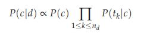
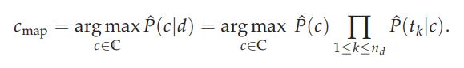
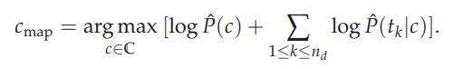

# 20Newsgroups-Classifier

Naïve Bayes classifier and Boolean retrieval done on the 20Newsgroups dataset that has been written from scratch. Extremely lightweight and produces decent results. Also currently working on classification using word embedding's.

## Naive Bayes
A classifier based on the Bayes' theorem. It's a probabilistic model that does not take into consideration the relationships between features - they are considered to be independent from one another - and is called a __Naive__ classifier. It has been used extensively to categorize text documents into categories, using information such as word frequency and occurrences in the sample set as the features.

### Conditional Probability
The Naive Bayes model is based on conditional and total probabilities, where if you give a vector of features \x, a probability is assigned for all available k classes.

   

Supervised learning method we introduce is the multinomial Naive Bayes or multinomial NB model, a probabilistic learning method. The probability of a document d being in class c is computed as

   
  <b>Multinomial Naive Bayes</b>

In text classification, our goal is to find the best class for the document. The best class in NB classification is the most likely or maximum a posteriori (MAP) class -

   
  <b>MAP</b>

Because of how small these values actually are, due to the monotonic nature of the logarithm function, we can simply rewrite the above equation and implement it as below -

   
  <b>Logarithmic MAP</b>

### Working

Needs to be added

Credits: text and equation borrowed from "Introduction to Information Retrieval", P.R. Raghavan et al.
